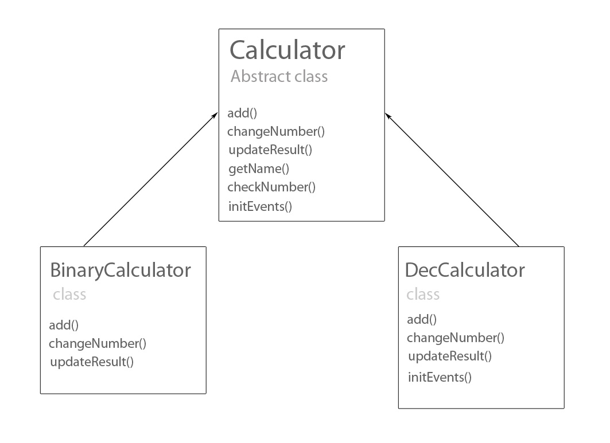

# ES6 workshop - calculators

## Setup

Create a fully working environment that will allow you to use ES6.

Remember to:
- Run ```npm init``` command
- Install appropriate modules
- Set Webpack - the input file should be `js/app.js`, the output `js/out.js`

Read this description before you do anything :)


## Mathematical abilities required to do this workshop

Adding numbers :)

## How does this workshop work?

* **First look at the files**
In the ```index.html``` file you will see two calculators (not styled yet). The first one is a binary calculator. The second one is decimal.
The binary calculator is already written - contrary to the decimal one. Your task is to:

    * Configure WebPacka so that it generates styles and adds them to HTML file.
    * Connect all the files in a way that both calculators work properly.
    * Finish the decimal calculator so that it adds decimal numbers.


* **Resources** In the ```js``` catalog you will find all the necessary files. The input file is ```app.js```. It is processed by Webpack which creates an ```out.js``` file based on it. ```out.js``` is linked to the ```index.html```.


## How should calculators work?

Both calculators work in a similar way. We can only add two numbers. After the overflow, the number is transferred.

### Rules for adding binary numbers

When adding binary numbers, remember the following rules:
* 0 + 0 = 0
* 0 + 1 = 1
* 1 + 0 = 1
* 1 + 1 = 10 - we leave "0", and transfer "1" one position further.

Example:
```JavaScript
    Number1: 0 1 1 0 1
    Number2: 0 0 1 0 1
    Result:  1 0 0 1 0    
```

If you still do not understand, take a look here:
More: http://eduinf.waw.pl/inf/alg/006_bin/0012.php
Graphic explanation: http://www.wikihow.com/Add-Binary-Numbers


### Rules for adding decimal numbers.
When adding decimal numbers, one should also remember about transferring.

### Your task

Your task is to write a decimal calculator and connect all files as shown in the diagram below.



#### Let's break it down to little steps:

**1. Configuring Webpack**

Configure the Webpack in such a way that you can initiate the project.

A ready configuration file ```webpack.config.js``` can be found in Snippets catalog.
All you have to do is install the appropriate modules. If you do not remember what modules to install, do not be afraid to start Webpack, the console will inform you everything that should be downloaded. Do not be afraid to read error messages :).

After successfully launching Webpack, open the `index.html` file in your browser.
Look carefully how the calculators are built.

**2. Detailed inspection of the available source code**

 * the binary calculator has already been written by the previous programmer. (see BinaryCalculator file)
 * The abstract class is ready as well, and the binary calculator inherits from it. (see Calculator file)

Let's discuss these methods from the beginning:
 * ```constructor()``` - if you look at the abstract class (don't remember what it was? Check it in the ES6 presentation) named ```Calculator```, you will see that something is already happening there. As you know, after creating an object, it is the constructor that is called automatically. It means that we can make all the initial setting here.

 The constructor explained in detail:     

```JavaScript
//When creating an object, we can set a name for it
this.name = selectorName;
//We also find the right selector
this.$calculatorDOMElement = $(selectorName);

//We create 3 arrays responsible for:
this.firstNumberArray = []; // storing the first number
this.secondNumberArray = []; // storing the second number
this.resultNumberArray = [0,0,0,0,0,0,0,0,0]; // storing the result

//We initialize the events - or start them :)
this.initEvents();
```


In the ```BinaryCalculator``` class in constructor, the ``` getName()```method displaying the name is called. Try to display the name of the decimal calculator in a similar way.


 * ```initEvents()``` - is a method that sets the click event on every div that holds a number. In the case of a binary calculator, after clicking on a div, the number immediately changes to the opposite one - 0 into 1, and vice versa.  A simple situation as in the binary system we only have two numbers. Look at the ```initEvents()``` method implemented in the abstract class. What does it do? After clicking on a number, it calls the ```changeNumber()```method -> let's move on to this method.

 * ```changeNumber()``` - this method is defined in the abstract class ```Calculator``` as well, but it does nothing. If you look at it, you will notice that it should be implemented in the inheriting class. In the ```BinaryCalculator``` class it is already implemented and it collapses or expands a given DOM element with a number. Note that after collapsing or expanding the element, next two methods are called: ```checkNumber()``` and ```updateResult()```.

 * ```checkNumber()``` - this method is already created in the abstract class. It collects values (digits) from DOM elements and passes them to the ```add()``` method, and later inserting of the result returned by the ``` add()``` in ```this.resultNumberArray```.

 * ```add()``` - each calculator can only add two numbers. The numbers can have 8 digits. The entire result is saved in an array. The array with the result has 9 digits. Why? Becaude if the user enters only the digits 1, the result will be one digit longer. Take a look:

 ```JavaScript
 Number1:  1 1 1 1 1 1 1 1
 Number2:  1 1 1 1 1 1 1 1
 Result: 1 1 1 1 1 1 1 1 0
 ```
 After adding two numbers and returning the correct result in the form of an array, it is saved in ```this.resultNumberArray```. Now, as you remember, the ```initEvents()``` method called two other methods: ```checkNumber()``` - which was covered, and ```updateResult()```. Let's move to the second one then.

 * ```updateResult() ```- the task of this method is to update the result on the page. The result we have stored in ```this.resultNumberArray``` so based on it we can fill DOM elements with specific values.

**3. Writing a decimal calculator**

1. Based on the class diagram (above), create appropriate methods and constructor in the `DecCalculator` class.

2. In `app.js` import an appropriate class and create an object for the decimal calculator.

3. **Initialization** - Abstract in its constructor initializes all necessary variables and objects for us. Check the ```BinaryCalculator``` class - there is still a called ``` getName()``` method in the constructor that displays selector name. Try to display the name of the decimal calculator similarly.

4. **Changing numbers** - Changing numbers in a binary calculator meant changing only two numbers. Unfortunately, we cannot change numbers in the decimal system the same way as it would be very uncomfortable. (For example, setting the number to 9 would require clicking 9 times). A better solution would be to allow the user to enter a number on their keyboard.
Modify the `changeNumber()` method in the `DecCalculator` class.
The easiest way will be to use the attribute: **contenteditable**. Add it to the clicked element (with active class) as an attribute and set its value to true. You can also call focus() on this element, e.g. `element.trigger("focus");`

5. **Modifying initEvents() method** - After entering the number, nothing will happen because we have to wait for the user. Therefore, it would be good if the user could inform the calculator that he has already finished entering numbers and he wants to add them.
Let's set a click event on the addition sign (plus).
Where do we initiate all events? Yes, of course, in the ```initEvents()``` class. So let's enter it (in the decimal calculator).
We want the click event to be set, but we also want to add an additional click event on the addition sign next in the decimal calculator. What should we do? We need to extend this method. Do you remember how to call a method from an abstract class?

After the extension, we add a new event that will call the ```checkNumber()``` and ```updateResult()``` methods when clicking the plus sign.

6. **Adding decimal numbers** - If the user clicks the plus sign, the numbers should be added and the result updated. If you look at the `checkNumber()` method, you will remember that it calls the `add()` method which you must overwrite in the decimal calculator. Look at the binary calculator and, based on it, create your own algorithm that will add two decimal numbers. Remember about transferring.


7. **Changing the result** - Clicking the plus sign not only adds two numbers but also calls the `updateResult()` method. You must overwrite it in the decimal calculator. One way to do this will be checking `this.resultNumberArray`, extracting values from it, and inserting them in the right places in the DOM element.


## For volunteers

### Additional methods

* validation of characters entered by the user to the decimal calculator.

  Note that in the case of a decimal calculator, the user can enter anything in a place where there should be a number. This is not a desirable situation. Our calculator cannot add anything else than decimal numbers.
  Create a method that will inform the user that he is entering the wrong character. Let him enter only one digit in one field.

* tooltip informing the user where to click after entering the first digit in order to see the result

  The user should immediately know what to do next after entering the first number. A small tootltip would be useful, e.g. above the addition sign, telling the user what to do next.
  Create a method that displays a tooltip. Set an appropriate event. Or maybe you have a better idea how to communicate to the user what he
  should do next?

### Another calculator

Perhaps a hexadecimal calculator? :D Or at least a calculator that adds numbers in a ternary numeral system?
